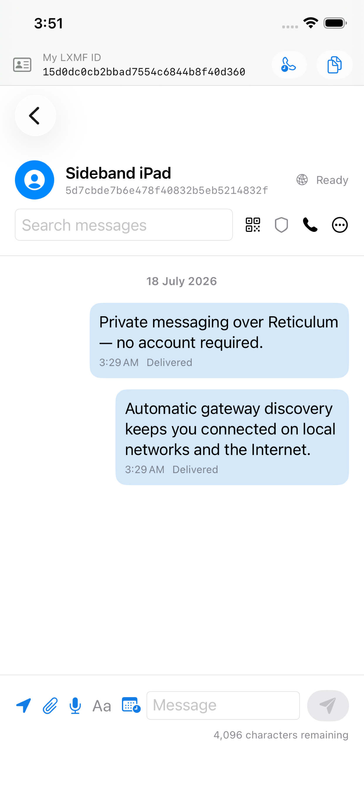
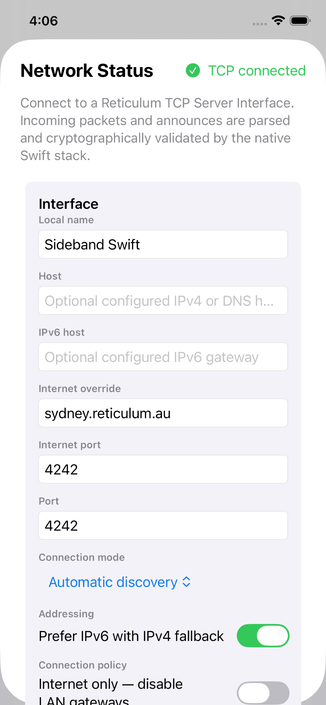

# Lower Sideband

Native Reticulum and LXMF messaging for macOS, iPhone, and iPad.

Lower Sideband is a Swift and SwiftUI adaptation of [Sideband](https://github.com/markqvist/Sideband). It provides private, delay-tolerant communication across local networks, public Reticulum infrastructure, and directly attached radio hardware—without embedding Python in the distributed application.

> **Project status:** active development. Current builds are development/TestFlight builds, not release candidates. Lower Sideband is not an emergency service.

<p align="center">
  
  
</p>

## Highlights

- Native Reticulum packet, identity, announce, path, link, proof, tunnel, and Resource handling
- LXMF direct, opportunistic, propagation-node, attachment, telemetry, stamps/tickets, ratchets, and low-bandwidth voice delivery
- Automatic local-first gateway discovery with public Internet fallback, IPv6 preference, and IPv4 fallback
- Concurrent TCP, WebSocket, HTTP tunnel, UDP, I2P, Weave, AutoInterface,
  RNode, serial, Bluetooth LE, Wi-Fi, KISS and AX.25 KISS interfaces
- Native RNode configuration, diagnostics, beaconing, framebuffer, ROM inspection, signed firmware catalogues, and verified update packages
- Standalone `ReticulumKit` framework with production-gated RNode TCP/KISS framing, configuration, telemetry, bounded flow control, and reconnect handling
- Encrypted text, images, files, voice notes, voice calls, replies, reactions, and scheduled messages
- Unified online/offline situation map, package validation, trails, and extended interoperable telemetry history
- Interactive Reticulum network map with live interfaces, next-hop transports, direct and multi-hop paths, search, filtering, and destination actions
- Contact fingerprints, QR/contact links, trust pinning, blocking, and user-reviewed safety reports
- Encrypted local persistence and optional encrypted private CloudKit synchronisation
- macOS Reticulum Transport Instance mode with route learning and loop suppression
- Permission-scoped native command, service, telemetry, structured status-card, and safe declarative plugin APIs
- Native hosted RRC rooms, an authorised RNCP send/receive/share workspace, and
  a Nomad Mesh Server for publishing Micron pages and downloadable files
- Interactive Micron fields and submissions, a persistent RRC community
  experience, and a validated unified directory for Nomad, RRC, RNSH, RNX and
  RNCP services
- Unified application-service activity, built-in wire-format diagnostics and
  privacy-bounded encrypted continuity of safe service preferences across devices

## Platform support

| Platform | Minimum | Application target | Notes |
| --- | ---: | --- | --- |
| macOS | 14 | `SidebandMac` | Full desktop UI, USB serial, optional Transport Instance mode |
| iOS | 17 | `SidebandIOS` | iPhone UI, BLE/Wi-Fi RNode, background refresh within iOS limits |
| iPadOS | 17 | `SidebandIOS` | Adaptive split-view interface |

The app is built with Swift 6 and SwiftUI. Runtime code uses Apple platform frameworks, the pinned `Ed25519` Swift package, and the official native Codec2 1.2.0 library. Python is used only by optional developer interoperability checks and is not included in application bundles.

The RNode TCP host path is covered by deterministic protocol vectors, fuzzing,
real Network.framework loopback tests, and a 2,500-packet flow-control soak.
Physical RNode testing is still required before BLE, USB serial, radio, power,
and firmware-update behaviour can be considered hardware-certified.

## Quick start

Prerequisites:

- Xcode 16 or newer
- macOS 14 or newer
- [XcodeGen](https://github.com/yonaskolb/XcodeGen) when regenerating the project

```sh
git clone --recurse-submodules https://github.com/vk3xxx/Lower-Sideband.git
cd Lower-Sideband
xcodegen generate
swift test
open MacSideband.xcodeproj
```

Select `SidebandMac` for macOS or `SidebandIOS` for an iPhone/iPad simulator or device. Lower Sideband starts in automatic connection mode: configured endpoints are tried first, then local discovery, then public Internet gateways.

For a complete unsigned verification pass:

```sh
Scripts/check-repository.sh
Scripts/validate-ios-app.sh 'generic/platform=iOS Simulator'
Scripts/test-rnode.sh protocol
Scripts/run-production-quality-gates.sh all
```

## Documentation

- [Building and running](docs/BUILDING.md)
- [Architecture](docs/ARCHITECTURE.md)
- [Networking and automatic discovery](docs/NETWORKING.md)
- [Reticulum network map](docs/NETWORK-MAP.md)
- [RNode and radio interfaces](docs/RNODE.md)
- [Testing and interoperability](docs/TESTING.md)
- [Managed connectivity infrastructure](docs/MANAGED-INFRASTRUCTURE.md)
- [Accessibility and localisation](docs/ACCESSIBILITY-AND-LOCALISATION.md)
- [Runtime and lifecycle hardening](docs/RUNTIME-HARDENING.md)
- [Migrating from Python Sideband](docs/MIGRATION.md)
- [Porting status and known gaps](PORTING.md)
- [Native feature parity](docs/FEATURE-PARITY.md)

All Reticulum packet, link, resource and interface implementations live in
the standalone `ReticulumKit` module. The app and LXMF layer consume that module
instead of carrying a second transport implementation.
- [Pinned Sideband / MeshChatX transport audit](docs/UPSTREAM-PARITY-AUDIT-2026-07-28.md)
- [Roadmap](docs/ROADMAP.md)
- [Privacy policy](PRIVACY.md)
- [Support](SUPPORT.md)
- [Security policy](SECURITY.md)
- [Contributing](CONTRIBUTING.md)
- [Changelog](CHANGELOG.md)

## Repository layout

```text
Sources/SidebandCore/     Native Reticulum, LXMF, persistence, sync, and models
Sources/SidebandMac/      Shared SwiftUI application and platform services
Vendor/                   Reproducibly built native Codec2 XCFramework and licence
Tests/                    Swift Testing regression and compatibility suite
Support/                  Entitlements, privacy manifests, assets, and export options
Scripts/                  Build, bundle, interoperability, and validation tools
AppStore/                 Store metadata and curated screenshots
docs/                     Architecture and developer documentation
*-Upstream/               Pinned upstream reference submodules
```

The checked-in Xcode project is generated from [`project.yml`](project.yml). Edit the YAML definition and regenerate the project; do not maintain divergent hand-edited project copies.

## Security and privacy

Reticulum/LXMF identities are kept in the Apple Keychain. Application snapshots and attachments are encrypted locally. Optional CloudKit records are encrypted before upload with key material from the synchronizable Keychain. Lower Sideband has no advertising SDK or third-party analytics.

Gateway operators and network providers can still observe transport metadata such as connection addresses, timing, and traffic volume. Review [SECURITY.md](SECURITY.md) for responsible disclosure and [PRIVACY.md](PRIVACY.md) for the complete data-handling statement.

## Upstream and licensing

This repository tracks pinned source snapshots of:

- [Sideband](https://github.com/markqvist/Sideband)
- [Reticulum](https://github.com/markqvist/Reticulum)
- [LXMF](https://github.com/markqvist/LXMF)

They are reference submodules and are not bundled into the Apple application targets. Lower Sideband is an independent adaptation and is not affiliated with or endorsed by the upstream author.

The adaptation is licensed under [CC BY-NC-SA 4.0](LICENSE). Upstream components, the Ed25519 dependency, and Codec2 retain their respective licences. See [NOTICE](NOTICE).
